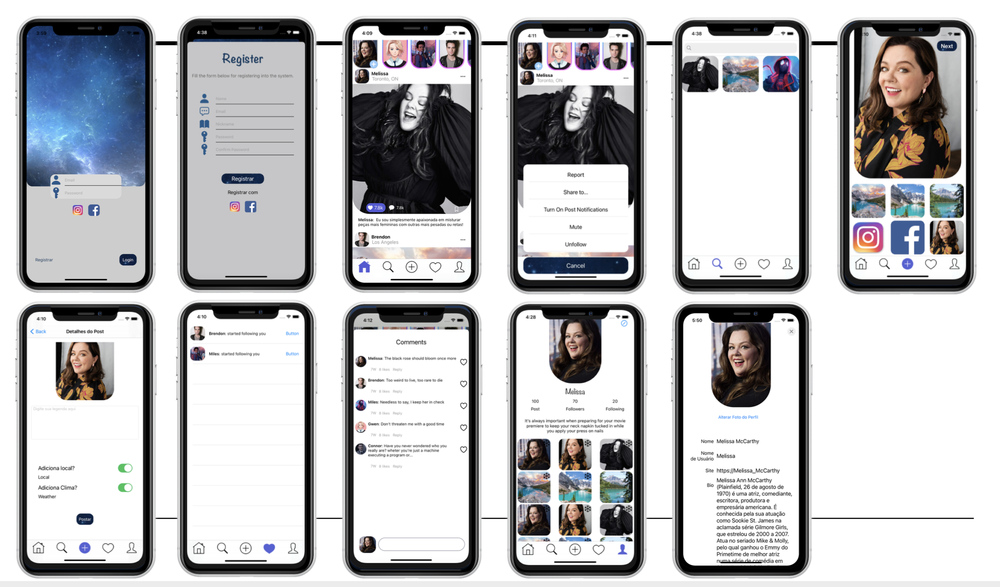

# ProjetoIntegrador

Universe - Projeto integrador da Rede social
This social media help you to connect with other people and have your photos shared with the weather and location.

Example
- You can share an image // stories,
- Follow and unfollow another user, 
- Edit a profile
- You can sign in with facebook, google or you can create a new account with our database.

Installation
To run the example project, clone the repo, and run pod install from the Example directory first.
		
Requirements
iOS 14 or newer
Swift 5

Pods: 
Acording to the pods used we highlight

  - Alamofire - for the api
  - Firebase - for login, authentication, database and storage
  - Kingfisher - for the images
  - GoogleSignIn - sign in with google
  - FBSDKLoginKit - sign in with Facebook

  pod 'Nimble-Snapshots' and pod 'KIF' - for tests

Author
Cleís Aurora (cleis_aurora@yahoo.com.br) and Mauro Juliano (maurodeveloper@outlook.com), 

If do you like, give your ⭐️

License
Universe is available under the MIT license. See the LICENSE file for more info

