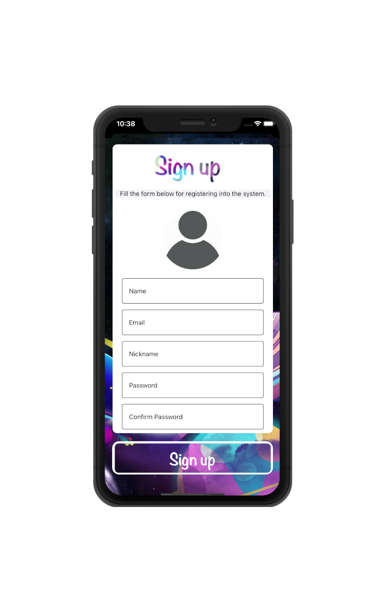
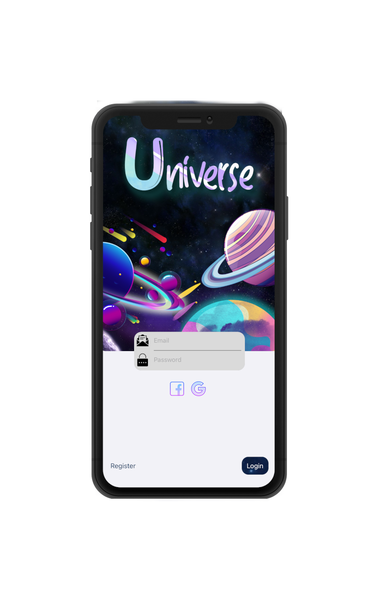
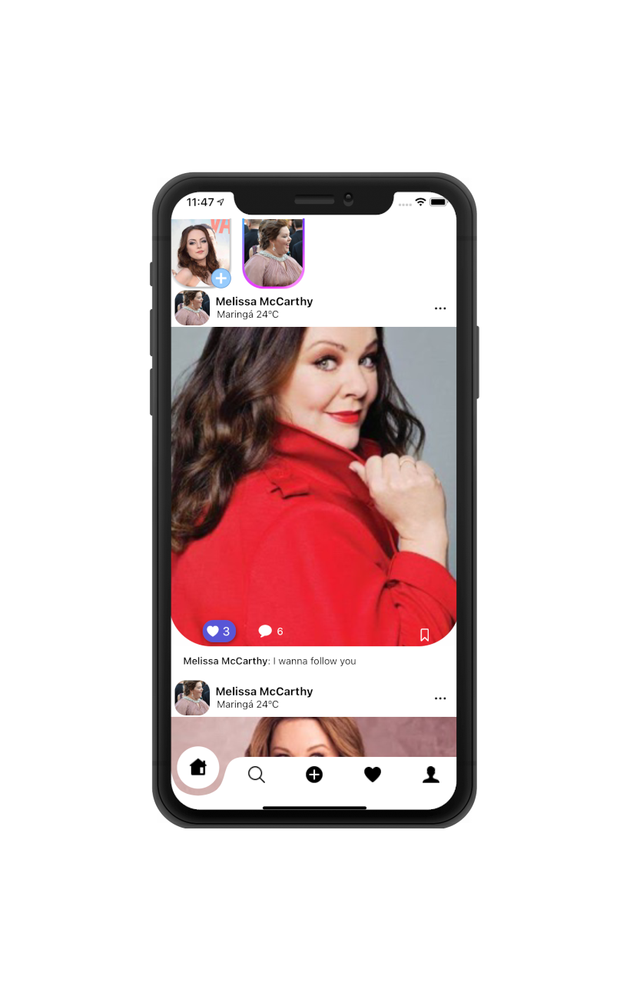
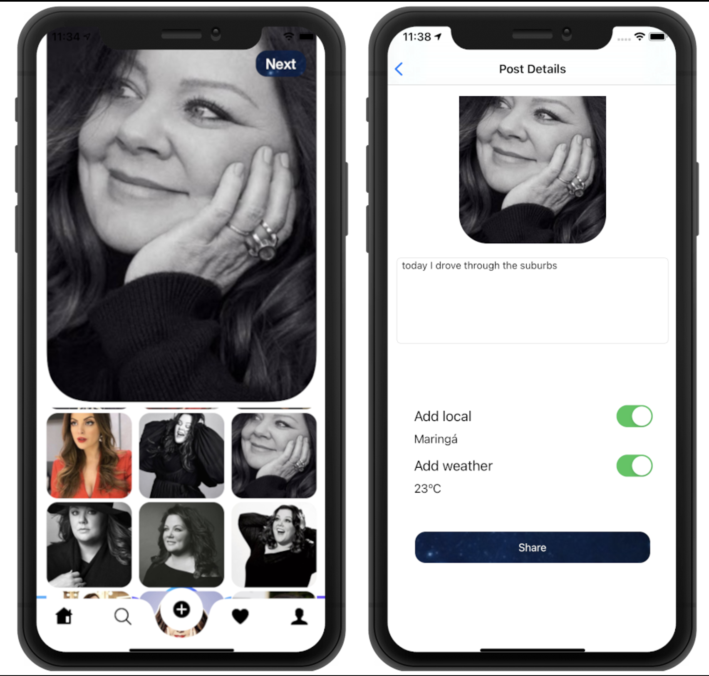

<h1>Universe</h1>

This social media help you to connect with other people and have your photos shared with the weather and location.

<h2>Summary</h2>

- You can share an image // stories,
- Follow and unfollow another user, 
- Edit a profile
- You can sign in with facebook, google or you can create a new account with our database.

<h2>Installation</h2>

- To run the example project, clone the repo, and run pod install from the Example directory first.
		
<h2>Requirements</h2>
- iOS 14 or newer
- Swift 5

<h2>The App</h2>
Universe é uma rede social onde o foco é compartilhar informações.
Universe chama atenção aos detalhes com seu design inovador, e criativo.

<h3>Sign Up</h3>
Para criar seu Universo é necessário se registrar em nosso servidor, por isso customizamos a tela de sign up para que o usuário tenha uma experiencia única desde o início.
Caso queira você também pode se registrar pelo Facebook, ou Google account.

<h3>Login</h3>
Após o registro o usuário pode efetuar o login em qualquer dispositivo através de seu e-mail seja pelo nosso banco de dados preenchendo os campos de dados, ou efetuar o login com google account ou Facebook através dos ícones específicos.

<h3>Feed</h3>
No feed você conseguirá acessar suas publicações, compartilhar stories.
E como principal está opção não é limitada apenas a visualização dos dados do seu usuário, você também poderá visualizar os stories e postagens de seus amigos.

<h3>Upload</h3>
No Upload nosso aplicativo precisará do acesso a sua galeria para carregarmos suas imagens, e assim popular o seu Universo, ao selecionar a imagem em especifico você terá a opção de avançar para adicionar mais dados a sua postagem.
Exemplo:
•	Deixe seu público saber o que você está pensando naquele momento com uma legenda inspiradora, ou apenas divertida.
•	Quer dizer ao seu público onde está o centro do Universo?! Você tem essa opção compartilhando a sua localidade.
•	Mesmo nas noites mais frias, ou nos dias mais quentes nada pode impedir você de compartilhar informação, e pensando nisso nós disponibilizamos pra que você possa mostrar o clima no qual você está.

 

<h3>Profile</h3>
No Profile você terá mais informações sobre o seu Usuário, ou o usuário selecionado, tais como nome do Usuário, foto de perfil, quantidade de post, quantidade de seguidores, e quantidade de pessoas seguindo, além de visualizar todas as publicações do usuário em questão.

<h2>Pods:</h2> 

According to the pods used we highlight

  - Alamofire - to consume the API request
  - Firebase - for login, authentication, database and storage
  - Kingfisher - for downloading and caching image from the web
  - GoogleSignIn - sign in with google
  - FBSDKLoginKit - sign in with Facebook
  - Nimble-Snapshots and KIF - for tests

<h2>Author</h2>

- Cleís Aurora (cleis_aurora@yahoo.com.br) and Mauro Juliano (maurodeveloper@outlook.com), 

If do you like, give your ⭐️

<h2>License</h2>
Universe is available under the MIT license. See the LICENSE file for more info

